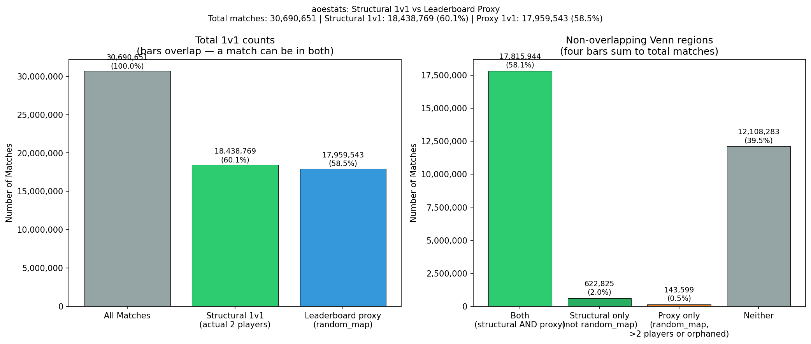

# Step 01_03_02 -- True 1v1 Match Identification: aoestats

**Generated:** 2026-04-16 09:54
**Dataset:** aoestats
**Invariants:** #6 (SQL verbatim), #7 (no magic numbers), #9 (profiling only)

## Summary

| Metric | Count | % of Total |
|--------|-------|------------|
| Total matches | 30,690,651 | 100.0% |
| Matches with player data | 30,477,761 | 99.31% |
| Matches without player data | 212,890 | 0.69% |
| **True 1v1** (2 player rows) | **18,438,769** | **60.0794%** |
| Ranked 1v1 (leaderboard='random_map') | 17,959,543 | 58.518% |

## Q1: Active Player Definition

Every row in players_raw is an active player. The schema has no observer/
spectator marker columns. winner is never NULL, civ is never NULL, team
has values {0, 1} only. profile_id has 1,185 NULLs (0.0011%).

## Q2: num_players vs Actual Player Count

### Cross-tabulation

| num_players | actual_player_count | match_count | pct |
|-------------|--------------------:|------------:|----:|
| 1 | 1 | 39 | 0.0001% |
| 2 | 0 | 147,294 | 0.4799% |
| 2 | 2 | 18,438,769 | 60.0794% |
| 3 | 0 | 1 | 0.0% |
| 3 | 3 | 349 | 0.0011% |
| 4 | 0 | 29,637 | 0.0966% |
| 4 | 4 | 5,027,632 | 16.3816% |
| 5 | 5 | 327 | 0.0011% |
| 6 | 0 | 12,347 | 0.0402% |
| 6 | 6 | 2,723,856 | 8.8752% |
| 7 | 7 | 651 | 0.0021% |
| 8 | 0 | 23,611 | 0.0769% |
| 8 | 8 | 4,286,138 | 13.9656% |

**Alignment:** 30,477,761 / 30,690,651 (99.3063%) of matches have num_players == actual player count.
**Mismatched:** 212,890 (0.6937%).

## Q3: True 1v1 Count

**True 1v1 matches (exactly 2 player rows): 18,438,769**

### By leaderboard

| leaderboard | match_count | pct_of_true_1v1 |
|-------------|------------:|----------------:|
| random_map | 17,815,944 | 96.6222% |
| co_random_map | 622,817 | 3.3778% |
| team_random_map | 7 | 0.0% |
| co_team_random_map | 1 | 0.0% |

## Q4: True 1v1 vs Ranked 1v1 Comparison

| Set | Count |
|-----|------:|
| True 1v1 (A) | 18,438,769 |
| Ranked 1v1 (B) | 17,959,543 |
| A AND B (overlap) | 17,815,944 |
| A NOT B (true only) | 622,825 |
| B NOT A (ranked only) | 143,599 |
| Neither | 12,108,283 |

**Jaccard index:** 0.958755
**Overlap as % of true 1v1:** 96.6222%
**Overlap as % of ranked 1v1:** 99.2004%

### Ranked 1v1 with != 2 player rows (anomalies)
| num_players | actual_player_count | match_count |
|-------------|--------------------:|------------:|
| 2 | 0 | 143,572 |
| 1 | 1 | 27 |

### True 1v1 from non-random_map leaderboards

| leaderboard | match_count | pct |
|-------------|------------:|----:|
| co_random_map | 622,817 | 99.9987% |
| team_random_map | 7 | 0.0011% |
| co_team_random_map | 1 | 0.0002% |

## Visualization



## SQL Queries (I6)

### active_player_diagnostic
```sql
SELECT
    COUNT(*) AS total_rows,
    COUNT(*) FILTER (WHERE winner IS NULL)     AS winner_null,
    COUNT(*) FILTER (WHERE civ IS NULL)        AS civ_null,
    COUNT(*) FILTER (WHERE team IS NULL)        AS team_null,
    COUNT(*) FILTER (WHERE profile_id IS NULL)  AS profile_id_null,
    COUNT(*) FILTER (WHERE game_id IS NULL)     AS game_id_null,
    -- Check if there are any rows where ALL of winner, civ, team are NULL
    -- (would suggest empty/observer slots)
    COUNT(*) FILTER (
        WHERE winner IS NULL AND civ IS NULL AND team IS NULL
    ) AS all_key_null,
    -- Check team value range
    MIN(team) AS team_min,
    MAX(team) AS team_max,
    COUNT(DISTINCT team) AS team_distinct
FROM players_raw
```

### num_players_vs_actual
```sql
WITH player_counts AS (
    SELECT
        game_id,
        COUNT(*) AS actual_player_count
    FROM players_raw
    GROUP BY game_id
)
SELECT
    m.num_players,
    COALESCE(pc.actual_player_count, 0) AS actual_player_count,
    COUNT(*) AS match_count,
    ROUND(100.0 * COUNT(*) / SUM(COUNT(*)) OVER(), 4) AS pct
FROM matches_raw m
LEFT JOIN player_counts pc ON m.game_id = pc.game_id
GROUP BY m.num_players, COALESCE(pc.actual_player_count, 0)
ORDER BY m.num_players, actual_player_count
```

### player_counts_distribution
```sql
SELECT
    actual_player_count,
    COUNT(*) AS num_matches
FROM (
    SELECT game_id, COUNT(*) AS actual_player_count
    FROM players_raw
    GROUP BY game_id
) sub
GROUP BY actual_player_count
ORDER BY actual_player_count
```

### true_1v1_count
```sql
WITH player_counts AS (
    SELECT
        game_id,
        COUNT(*) AS actual_player_count
    FROM players_raw
    GROUP BY game_id
    HAVING COUNT(*) = 2
)
SELECT COUNT(*) AS true_1v1_count
FROM player_counts
```

### duplicate_impact
```sql
WITH raw_counts AS (
    SELECT game_id, COUNT(*) AS raw_count
    FROM players_raw
    GROUP BY game_id
),
distinct_counts AS (
    SELECT game_id, COUNT(DISTINCT profile_id) AS distinct_profiles
    FROM players_raw
    GROUP BY game_id
)
SELECT
    COUNT(*) FILTER (WHERE rc.raw_count = 2) AS matches_exactly_2_raw,
    COUNT(*) FILTER (WHERE dc.distinct_profiles = 2) AS matches_exactly_2_distinct,
    COUNT(*) FILTER (WHERE rc.raw_count != 2 AND dc.distinct_profiles = 2)
        AS recovered_by_dedup,
    COUNT(*) FILTER (WHERE rc.raw_count = 3 AND dc.distinct_profiles = 2)
        AS misclassified_count_3_but_2_distinct
FROM raw_counts rc
JOIN distinct_counts dc ON rc.game_id = dc.game_id
```

### true_1v1_by_leaderboard
```sql
WITH player_counts AS (
    SELECT
        game_id,
        COUNT(*) AS actual_player_count
    FROM players_raw
    GROUP BY game_id
    HAVING COUNT(*) = 2
)
SELECT
    m.leaderboard,
    COUNT(*) AS match_count,
    ROUND(100.0 * COUNT(*) / SUM(COUNT(*)) OVER(), 4) AS pct_of_true_1v1
FROM matches_raw m
INNER JOIN player_counts pc ON m.game_id = pc.game_id
GROUP BY m.leaderboard
ORDER BY match_count DESC
```

### true_1v1_by_num_players
```sql
WITH player_counts AS (
    SELECT
        game_id,
        COUNT(*) AS actual_player_count
    FROM players_raw
    GROUP BY game_id
    HAVING COUNT(*) = 2
)
SELECT
    m.num_players,
    COUNT(*) AS match_count
FROM matches_raw m
INNER JOIN player_counts pc ON m.game_id = pc.game_id
GROUP BY m.num_players
ORDER BY m.num_players
```

### set_comparison
```sql
WITH player_counts AS (
    SELECT
        game_id,
        COUNT(*) AS actual_player_count
    FROM players_raw
    GROUP BY game_id
),
classified AS (
    SELECT
        m.game_id,
        m.leaderboard,
        m.num_players,
        COALESCE(pc.actual_player_count, 0) AS actual_player_count,
        (COALESCE(pc.actual_player_count, 0) = 2)    AS is_true_1v1,
        (m.leaderboard = 'random_map')                AS is_ranked_1v1
    FROM matches_raw m
    LEFT JOIN player_counts pc ON m.game_id = pc.game_id
)
SELECT
    COUNT(*) AS total_matches,
    COUNT(*) FILTER (WHERE is_true_1v1)                               AS true_1v1,
    COUNT(*) FILTER (WHERE is_ranked_1v1)                             AS ranked_1v1,
    COUNT(*) FILTER (WHERE is_true_1v1 AND is_ranked_1v1)             AS overlap_both,
    COUNT(*) FILTER (WHERE is_true_1v1 AND NOT is_ranked_1v1)         AS true_only,
    COUNT(*) FILTER (WHERE NOT is_true_1v1 AND is_ranked_1v1)         AS ranked_only,
    COUNT(*) FILTER (WHERE NOT is_true_1v1 AND NOT is_ranked_1v1)     AS neither
FROM classified
```

### ranked_not_true_1v1
```sql
WITH player_counts AS (
    SELECT
        game_id,
        COUNT(*) AS actual_player_count
    FROM players_raw
    GROUP BY game_id
)
SELECT
    m.num_players,
    COALESCE(pc.actual_player_count, 0) AS actual_player_count,
    COUNT(*) AS match_count
FROM matches_raw m
LEFT JOIN player_counts pc ON m.game_id = pc.game_id
WHERE m.leaderboard = 'random_map'
  AND COALESCE(pc.actual_player_count, 0) != 2
GROUP BY m.num_players, COALESCE(pc.actual_player_count, 0)
ORDER BY match_count DESC
```

### true_not_ranked
```sql
WITH player_counts AS (
    SELECT
        game_id,
        COUNT(*) AS actual_player_count
    FROM players_raw
    GROUP BY game_id
    HAVING COUNT(*) = 2
)
SELECT
    m.leaderboard,
    COUNT(*) AS match_count,
    ROUND(100.0 * COUNT(*) / SUM(COUNT(*)) OVER(), 4) AS pct
FROM matches_raw m
INNER JOIN player_counts pc ON m.game_id = pc.game_id
WHERE m.leaderboard != 'random_map'
GROUP BY m.leaderboard
ORDER BY match_count DESC
```

### null_profile_by_type
```sql
WITH player_counts AS (
    SELECT
        game_id,
        COUNT(*) AS actual_player_count
    FROM players_raw
    GROUP BY game_id
)
SELECT
    m.leaderboard,
    COALESCE(pc.actual_player_count, 0) AS actual_player_count,
    COUNT(*) AS null_profile_rows
FROM players_raw p
INNER JOIN matches_raw m ON p.game_id = m.game_id
LEFT JOIN player_counts pc ON p.game_id = pc.game_id
WHERE p.profile_id IS NULL
GROUP BY m.leaderboard, COALESCE(pc.actual_player_count, 0)
ORDER BY null_profile_rows DESC
```

### sample_true_1v1
```sql
SELECT m.game_id, m.leaderboard, m.num_players,
       p.profile_id, p.winner, p.civ, p.team
FROM matches_raw m
JOIN players_raw p ON m.game_id = p.game_id
WHERE m.game_id IN (
    SELECT game_id FROM players_raw
    GROUP BY game_id HAVING COUNT(*) = 2
    LIMIT 5
)
ORDER BY m.game_id, p.team
```

### sample_non_1v1
```sql
SELECT m.game_id, m.leaderboard, m.num_players,
       COUNT(p.profile_id) AS actual_player_count,
       LIST(p.civ ORDER BY p.team) AS civs,
       LIST(p.team ORDER BY p.team) AS teams,
       LIST(p.winner ORDER BY p.team) AS winners
FROM matches_raw m
JOIN players_raw p ON m.game_id = p.game_id
WHERE m.game_id IN (
    SELECT game_id FROM players_raw
    GROUP BY game_id HAVING COUNT(*) != 2
    LIMIT 5
)
GROUP BY m.game_id, m.leaderboard, m.num_players
ORDER BY actual_player_count DESC
```
