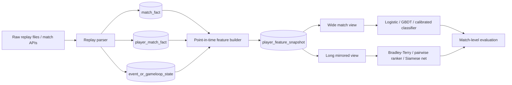
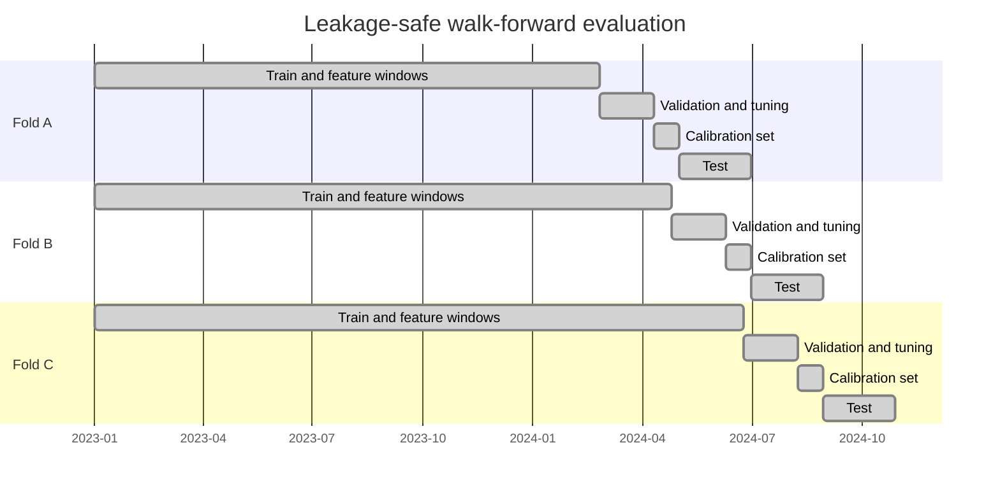

# Table Format and Data Modeling for 1v1 RTS Outcome Prediction

## Executive summary

The most defensible thesis design is **not** to choose a single warehouse format and stop there. The best overall architecture is a **normalized long event store** for replay ingestion and point-in-time feature generation, plus **two derived modeling views**: a **wide, one-row-per-match table** as the primary tabular benchmark and likely final thesis model input, and a **long, two-rows-per-match mirrored table** as the secondary representation for paired-comparison, ranking, and shared-weight neural models. That recommendation follows from paired-comparison theory, which models win probability through score differences, and from modern tabular benchmarks showing that tree ensembles remain exceptionally strong on medium-sized structured data. citeturn25view0turn28view0turn18view6turn29view0turn32view0turn32view1

If the thesis objective is the **pre-match probability that player A wins**, the primary modeling table should be **wide**. It aligns one row with one prediction target, simplifies probability calibration at the match level, avoids duplicated observations, and makes temporal evaluation cleaner. The **long** format should still be built and compared experimentally, because it is natural for player-centric history computation, shared encoders, Bradley-Terry-style models, and pairwise/ranking objectives. A replay-based StarCraft study is especially relevant here: it explicitly compared **single-player**, **both-player concatenation**, and **difference** representations, and found that paired representations were stronger than single-player-only features. citeturn36view2turn36view0turn36view3turn21view3

Feature engineering should be centered on **point-in-time, player-relative summaries**: dynamic skill ratings, recent form, matchup context, map and patch effects, head-to-head history, and opponent-relative transformations such as differences, ratios, and selected interactions. In public StarCraft work, economic and army-management indicators repeatedly emerge as important, and studies distinguish symmetric versus asymmetric race matchups because matchup context changes predictive structure. citeturn19view2turn33view4turn26view0

Leakage prevention is a first-class design requirement. The critical safeguards are: compute all features from histories available strictly **before** the match start; split evaluation **chronologically**; keep both rows of a match together in the same fold when using long format; fit any calibrator on **disjoint** data; and avoid randomized CV on time-ordered match data. Leakage literature, time-series evaluation studies, and calibration guidance all support this stance. citeturn37search16turn37search3turn18view14turn38view0turn21view3

## Problem framing and thesis recommendation

A 1v1 RTS winner-prediction problem is, mathematically, a **paired-comparison problem**. In the canonical Bradley-Terry formulation, the log-odds that item or player \(i\) beats \(j\) is the **difference** of their latent strengths, optionally with an intercept for a systematic first-item or home-side effect. That immediately tells you something important about data structure: any representation that makes relative strength and relative context easy to learn is well aligned with the underlying statistical object. citeturn25view0

Dynamic rating systems formalize the same intuition. Mark Glickman’s review of the Elo system shows that Elo predicts outcomes from rating differences and updates ratings recursively from the gap between expected and observed score; Glickman’s Glicko paper states that Elo is a special case of the more general system; and the entity["organization","Microsoft Research","research lab"] TrueSkill publication describes a Bayesian generalization that tracks uncertainty, models draws, and supports team results. For a 1v1 RTS thesis, these are not just baselines; they are compact, theoretically motivated feature generators that summarize long histories into leakage-safe pre-match covariates. citeturn28view0turn18view6turn29view0

The central recommendation is therefore:

**Use a layered architecture.**
1. Keep replay ingestion and history computation in normalized long form.
2. Materialize a point-in-time player feature snapshot table.
3. Derive both wide and long supervised-learning tables from those snapshots.
4. Make the **wide match-level table the primary representation** for the main thesis result.
5. Use the **long mirrored table** for ablations, pairwise/ranking models, and shared-weight neural models.

This is the strongest thesis design because it is analytically rigorous, easy to defend methodologically, and broad enough to compare classical statistics, tabular ML, and neural pairwise methods under one common pipeline. citeturn25view0turn32view0turn32view1turn21view3

One additional boundary condition matters: public RTS papers often mix **pre-match prediction** and **in-game early prediction**. SC2LE and early StarCraft studies use current-match snapshots to predict eventual winners, and those are legitimate tasks, but they are **not the same as pre-match forecasting**. If your thesis target is pre-match winner prediction, current-match telemetry such as minute-5 economy, unit counts, or action streams must be excluded from the core model and, if studied, moved into a separate horizon-conditioned early-prediction chapter. citeturn19view8turn35view0

## Wide and long table designs

### Comparative view

| Aspect | Wide format | Long format |
|---|---|---|
| Basic row semantics | 1 row = 1 match | 2 rows = 1 match, one focal-player row per side |
| Direct alignment with target | Excellent: one probability per match winner | Indirect unless you enforce paired consistency |
| Natural fit to paired-comparison theory | Good when you include \(A-B\) differences and interactions | Excellent when each row is focal-player-relative |
| Symmetry handling | Must be designed explicitly with canonical ordering, swap augmentation, or antisymmetric engineered features | Easier to express if features are focal-minus-opponent, but probabilities can still become inconsistent unless constrained |
| Effective sample size | Exactly the number of matches | Still the number of matches, even though row count doubles |
| Feature engineering effort | More manual when concatenating two sides and context interactions | More natural for player-centric rolling histories and shared preprocessing |
| Evaluation at match level | Straightforward | Must aggregate or constrain paired rows and keep match-level grouping |
| Calibration | Simple and clean at match level | Tricker if two independently scored rows do not sum to 1 |
| Interpretability | High for logistic regression and tree ensembles on structured deltas | High for relative-feature GLMs; more complex for generic row-level learners |
| Scalability | Feature width can grow fast | Row count doubles, but schema is tidy and easy to pipeline |
| Best use case | Main supervised benchmark and final deployment-style predictor | Canonical feature store, Bradley-Terry-style models, ranking objectives, Siamese/shared encoders |

This comparison is a synthesis of paired-comparison modeling, replay-based paired feature representations, and probability-calibration constraints. Bradley-Terry directly privileges differences; replay-based StarCraft work explicitly compares single-player, concatenated, and difference encodings; and scikit-learn’s calibration guidance emphasizes that unbiased, disjoint calibration data must be respected. citeturn25view0turn36view2turn36view0turn21view3

### Practical conclusion

For the **main thesis benchmark**, choose **wide**.

The reason is not that long is weak. It is that a thesis must be methodologically easy to audit. With wide tables, the unit of prediction, the unit of calibration, and the unit of evaluation are all identical: **the match**. That sharply reduces ambiguity when reporting accuracy, AUC, log loss, Brier score, and calibration curves. It also makes it easier to compare a Bradley-Terry-style logistic baseline, boosted trees, and calibrated variants under exactly the same target definition. citeturn22view5turn22view6turn22view4turn21view3

For the **secondary representation**, keep **long**.

Long form is superior as a canonical feature store and is the right substrate for focal-player-relative pipelines, player embeddings, shared encoders, and ranking-style learners. It also mirrors the way replay data are naturally ingested: match-participant tables, event streams, and player histories. But in long format you must guard against a common methodological error: treating the two rows of one match as independent evidence. They are not. A replay-based StarCraft paper states that because one player must win and the other lose, that paired constraint should also hold for the prediction. citeturn36view3

## Recommended schemas and feature construction

Public RTS datasets and official parsers already suggest the right base architecture. SC2EGSet exposes replay-level fields including headers, details, and event structures; Blizzard’s official `s2protocol` decodes headers, details, init data, game events, message events, and tracker events; Blizzard’s SC2 client API also exposes replay analysis and official replay packs. Those sources strongly support a normalized ingestion layer followed by point-in-time feature materialization. citeturn26view0turn27view0turn27view1



### Recommended source-of-truth schema

```sql
-- Replay- and match-level facts
CREATE TABLE match_fact (
    match_id            STRING PRIMARY KEY,
    game_title          STRING,
    source_system       STRING,
    replay_id           STRING,
    match_start_ts      TIMESTAMP,
    patch_version       STRING,
    map_id              STRING,
    map_pool_season     STRING,
    tournament_id       STRING,
    best_of             INT,
    duration_sec        INT
);

-- One row per player per match
CREATE TABLE player_match_fact (
    match_id              STRING,
    player_id             STRING,
    opponent_id           STRING,
    player_slot           SMALLINT,
    player_race           STRING,
    opponent_race         STRING,
    player_mmr_pre_raw    FLOAT,
    outcome_win           BOOLEAN,
    resign_flag           BOOLEAN,
    PRIMARY KEY (match_id, player_id)
);

-- Optional replay-derived state/event table
CREATE TABLE replay_state_event (
    match_id            STRING,
    player_id           STRING,
    event_ts            TIMESTAMP,
    game_loop           BIGINT,
    event_type          STRING,
    minerals_current    FLOAT,
    minerals_rate       FLOAT,
    gas_current         FLOAT,
    workers_active      FLOAT,
    army_value          FLOAT,
    action_count        INT
);

-- Point-in-time pre-match snapshot table
CREATE TABLE player_feature_snapshot (
    match_id                    STRING,
    player_id                   STRING,
    asof_ts                     TIMESTAMP,
    n_prev_matches_30d          INT,
    win_rate_5                  FLOAT,
    win_rate_20                 FLOAT,
    avg_duration_20             FLOAT,
    avg_opponent_rating_20      FLOAT,
    elo_pre                     FLOAT,
    glicko_mu_pre               FLOAT,
    glicko_rd_pre               FLOAT,
    trueskill_mu_pre            FLOAT,
    trueskill_sigma_pre         FLOAT,
    h2h_wins_vs_opp_pre         INT,
    h2h_matches_vs_opp_pre      INT,
    map_win_rate_pre            FLOAT,
    matchup_win_rate_pre        FLOAT,
    days_since_last_match       FLOAT,
    feature_availability_mask   STRING,
    PRIMARY KEY (match_id, player_id)
);
```

### Recommended wide modeling view

```sql
CREATE VIEW match_wide AS
SELECT
    m.match_id,
    m.match_start_ts,
    m.patch_version,
    m.map_id,
    a.player_id                     AS playerA_id,
    b.player_id                     AS playerB_id,
    a.player_race                   AS playerA_race,
    b.player_race                   AS playerB_race,
    fa.elo_pre                      AS playerA_elo_pre,
    fb.elo_pre                      AS playerB_elo_pre,
    fa.win_rate_20                  AS playerA_win_rate_20,
    fb.win_rate_20                  AS playerB_win_rate_20,
    fa.map_win_rate_pre             AS playerA_map_wr_pre,
    fb.map_win_rate_pre             AS playerB_map_wr_pre,
    fa.h2h_wins_vs_opp_pre          AS playerA_h2h_wins_pre,
    fb.h2h_wins_vs_opp_pre          AS playerB_h2h_wins_pre,

    -- engineered pair features
    fa.elo_pre - fb.elo_pre         AS delta_elo,
    fa.win_rate_20 - fb.win_rate_20 AS delta_win_rate_20,
    (fa.win_rate_20 + 1e-6) / (fb.win_rate_20 + 1e-6) AS ratio_win_rate_20,
    CONCAT(a.player_race, '_vs_', b.player_race)      AS matchup,
    CASE WHEN a.outcome_win THEN 1 ELSE 0 END         AS label_playerA_wins
FROM match_fact m
JOIN player_match_fact a ON m.match_id = a.match_id
JOIN player_match_fact b ON m.match_id = b.match_id AND a.player_id < b.player_id
JOIN player_feature_snapshot fa ON fa.match_id = a.match_id AND fa.player_id = a.player_id
JOIN player_feature_snapshot fb ON fb.match_id = b.match_id AND fb.player_id = b.player_id;
```

### Recommended long mirrored modeling view

```sql
CREATE VIEW match_long AS
SELECT
    m.match_id,
    m.match_start_ts,
    focal.player_id                    AS focal_player_id,
    focal.opponent_id                  AS opponent_id,
    focal.player_race                  AS focal_race,
    focal.opponent_race                AS opp_race,
    m.patch_version,
    m.map_id,

    ff.elo_pre                         AS focal_elo_pre,
    fo.elo_pre                         AS opp_elo_pre,
    ff.win_rate_20                     AS focal_win_rate_20,
    fo.win_rate_20                     AS opp_win_rate_20,
    ff.h2h_wins_vs_opp_pre             AS focal_h2h_wins_pre,
    ff.h2h_matches_vs_opp_pre          AS focal_h2h_matches_pre,

    -- player-relative features
    ff.elo_pre - fo.elo_pre            AS elo_diff,
    ff.win_rate_20 - fo.win_rate_20    AS win_rate_20_diff,
    (ff.win_rate_20 + 1e-6)/(fo.win_rate_20 + 1e-6)   AS win_rate_20_ratio,
    CASE WHEN focal.outcome_win THEN 1 ELSE 0 END     AS label_win
FROM match_fact m
JOIN player_match_fact focal ON m.match_id = focal.match_id
JOIN player_feature_snapshot ff ON ff.match_id = focal.match_id AND ff.player_id = focal.player_id
JOIN player_feature_snapshot fo ON fo.match_id = focal.match_id AND fo.player_id = focal.opponent_id;
```

### Feature families that matter most

| Feature family | Examples | Why it matters | Preferred storage |
|---|---|---|---|
| Dynamic skill summaries | Elo, Glicko, TrueSkill \(\mu,\sigma\) | Fast, compact representation of long-run strength and uncertainty | Snapshot table, then both wide and long |
| Historical aggregates | Lifetime or rolling win rate, average game length, average opponent strength | Stable pre-match priors | Snapshot table |
| Recent form | Last 5, 10, 20 matches; exponentially decayed wins; rest days | Captures short-term drift | Snapshot table |
| Head-to-head | Prior meetings, decayed H2H win share | Useful when repeat pairings exist, but must be shrunk | Snapshot table |
| Contextual factors | Map, patch, race matchup, tournament tier, best-of format | RTS outcomes are context-sensitive and patch-sensitive | Match fact + engineered interactions |
| Replay-derived sequence summaries | Mean/variance/trend of prior match states or openings | Useful for richer style encoding | Separate sequence store + derived features |
| Early-prediction current-match telemetry | Minute-\(t\) resources, units, APM, build state | Only valid for a separate in-game horizon task | Separate chapter/task, not the pre-match core model |

RTS prediction studies support the importance of contextual and economic features. One StarCraft paper explicitly separates symmetric and asymmetric matchup types and finds notable feature-importance differences; a StarCraft II logistic-regression study reports significant coefficients for MMR, minerals collection, army-related mineral measures, and economy variables, while APM was not significant in that setting. citeturn19view2turn33view4

## Modeling implications

For **classical statistics and interpretable baselines**, start with a Bradley-Terry-style or logistic-regression model. In paired-comparison form, the natural sufficient signals are relative skill and relative context, so a strong first baseline is:

\[
\Pr(A \text{ wins}) = \sigma\big(
\beta_0
+ \beta_1 \Delta \text{rating}
+ \beta_2 \Delta \text{recent form}
+ \beta_3 \text{H2H}
+ \beta_4 \text{map/race interactions}
\big)
\]

That baseline is scientifically valuable because it is easy to explain, easy to calibrate, and easy to audit for leakage. It also maps directly to what prior RTS studies have done when trying to identify “determinants of victory.” citeturn25view0turn33view4

For **tabular prediction accuracy**, the main baseline family should be boosted trees: XGBoost, LightGBM, and CatBoost. XGBoost is an optimized distributed tree-boosting system; LightGBM was designed specifically for high efficiency and speed; CatBoost adds ordered boosting and specialized handling for categorical features while addressing target leakage and prediction shift. On medium-sized tabular datasets, recent benchmarks still show that tree-based models remain state-of-the-art or at least extremely hard to beat consistently. citeturn11search8turn18view9turn18view10turn32view0turn32view1

For **pairwise or ranking reframings**, long format becomes more compelling. XGBoost’s ranking tutorial states that LambdaMART is a pairwise ranking model grouped by a query ID; LightGBM exposes `lambdarank`; CatBoost supports pairwise winner-loser information with group IDs. If your thesis includes “who is most likely to win among many scheduled matches this week” or “rank players by expected event win probability,” these ranking learners are appropriate secondary models. For isolated 1v1 match prediction, however, ranking should be treated as an auxiliary formulation rather than the main target. citeturn22view8turn22view9turn22view10

For **neural models**, there are two realistic routes. The first is a standard tabular MLP or FT-Transformer on the **wide** table. The second, more structurally elegant route is a **Siamese/shared-weight model** over two player histories. Siamese networks were introduced as twin networks with tied weights; later work emphasizes that the symmetry of the architecture makes it especially suitable when exchanging the two inputs should not change the latent encoding logic. For paired players in a 1v1 RTS, that symmetry is often desirable. Still, recent tabular benchmarks show that deep models are not universally superior to GBDTs, so neural models should be thesis comparison arms, not the only serious baseline family. citeturn31view1turn31view2turn32view0turn32view1

### Default feature-combination strategy

A strong, defensible default stack is:

| Strategy | Recommendation | Why |
|---|---|---|
| Concatenation | **Use** in wide tables | Gives trees and neural nets raw access to both sides |
| Differences | **Always use** | Best aligned with paired-comparison theory |
| Ratios | **Use selectively** | Helps where scale matters, but clip/stabilize denominators |
| Interactions | **Use sparingly but deliberately** | Especially useful for map × matchup, player race × opponent race, rating × patch |
| Elo/Glicko/TrueSkill | **Use early** | Compact and theoretically grounded summaries of history |
| Player or map embeddings | **Use only with enough data** | High-capacity representations, but easier to overfit |
| Full sequence encoders | **Use as a later-stage experiment** | Best when you have abundant time-series or replay-state histories |

A useful empirical lesson comes from early StarCraft outcome prediction: both-player and difference representations beat single-player-only features, and temporal summaries improved performance further. That does not prove the same ranking for pre-match tasks, but it strongly supports building opponent-relative views rather than only focal-player aggregates. citeturn36view2turn36view0

### Missing data and imbalance

Missingness should be treated as **information**, not just noise. In RTS telemetry, missing values can arise because a player is new, a map has few prior games, a patch is recent, or replay extraction failed for some fields. The best practice is to create **availability flags**, impute using training-fold-only statistics where necessary, and rely on native missing-value support when using tree ensembles. XGBoost, LightGBM, and CatBoost all support missing numerical features natively. citeturn22view11turn22view12turn22view13

Class imbalance is usually **not severe globally** in 1v1 winner prediction because each match has exactly one winner and one loser. The imbalance problem appears after canonical ordering, filtering by subsets such as rare matchups or upset-only analyses, or when predicting special events. In those cases, do not oversample across time boundaries; instead use train-fold-only class weighting, threshold-free metrics, and side-swap augmentation where appropriate. Calibration remains more important than optimizing raw threshold accuracy alone. citeturn22view5turn22view4turn18view15

## Leakage control and evaluation design

Leakage is the introduction of information about the target that should not be legitimately available for prediction. In an RTS thesis, the most common leakage sources are not exotic. They are mundane: all-time player aggregates that accidentally include future matches; target encodings fit on the full dataset; current-match duration or post-game economy used in a supposedly pre-match model; and train-test splits that separate the two mirrored rows of one long-format match. Leakage literature is unequivocal that these mistakes create overoptimistic performance. citeturn37search16turn37search3turn37search6

The split strategy must preserve time. Scikit-learn’s `TimeSeriesSplit` exists specifically because ordinary CV would train on the future and evaluate on the past, and Cerqueira, Torgo, and Mozetič show that standard randomized CV is inappropriate for time-ordered settings. Their analysis further suggests that blocked CV can be reasonable for stationary series, whereas repeated out-of-sample holdouts are better when the process is non-stationary. Competitive RTS data are usually **non-stationary** because balance patches, map pools, tournament eras, and player form evolve. citeturn18view14turn38view0



### Evaluation metrics

| Metric | Role in thesis | Why it matters |
|---|---|---|
| Accuracy | Secondary | Intuitive headline number, but threshold-dependent |
| ROC AUC | Secondary | Threshold-free discrimination at match level |
| Log loss | **Primary** | Proper scoring rule for probabilistic winner prediction |
| Brier score | **Primary co-metric** | Proper scoring rule that is easy to interpret as squared probability error |
| Calibration curve / reliability diagram | **Mandatory** | Shows whether 0.7 actually means ~70% wins |
| ECE or bin-wise calibration error | Useful supplementary | Compact calibration summary |
| Ranking metrics such as NDCG/MRR | Optional | Only if you explicitly reframe to grouped ranking tasks |

Scikit-learn’s documentation defines log loss as negative log-likelihood, Brier score as mean squared probability error and a strictly proper scoring rule, and calibration tools as essential when predicted probabilities themselves are decision-relevant. A subtle but important point: isotonic calibration can introduce ties and thereby change ROC AUC, whereas sigmoid calibration preserves ranking. citeturn22view5turn22view4turn18view15turn21view1turn21view2

### Recommended cross-validation protocol

Use a **nested, walk-forward design**.

- **Outer loop:** 3 to 5 chronological test blocks.
- **Inner loop:** walk-forward tuning on the training period only.
- **Calibration split:** a final disjoint slice after tuning and before the test block.
- **Grouping:** keep both rows of a long-format match in the same split; if you evaluate at tournament granularity, group by tournament or week as well.
- **No random shuffling.**
- **All feature transforms, imputers, encoders, and rating updates must be fit only with the current training window.**

If you need grouped temporal splits, `GroupKFold` handles groups but not chronology, `TimeSeriesSplit` handles chronology but assumes equally spaced observations, and `GroupTimeSeriesSplit` from mlxtend is a practical compromise for grouped temporal holdouts. In irregular esports logs, explicit date-block splitting is usually the cleanest approach. citeturn18view13turn18view14turn27view6

### Statistical testing

For a thesis, I recommend the following hierarchy.

1. **Final held-out test period:** report 95% **block-bootstrap confidence intervals** for all metrics, resampling by day, week, or tournament so dependence within periods is respected. This is the most practical all-purpose uncertainty estimate for esports logs.  
2. **AUC comparisons on the same test set:** use **DeLong’s test** for correlated ROC AUCs. citeturn18view19  
3. **Across multiple outer folds or multiple datasets:** use **Wilcoxon signed-rank** for two-model comparisons and **Friedman plus post-hoc critical-difference style comparisons** when comparing many models. Demšar explicitly recommends these non-parametric tests for multi-dataset classifier comparisons. citeturn24view1turn23view3turn23view4  
4. **Accuracy comparisons:** if you want a discrete 0/1 comparison, use a paired test on the final test block only, not per-row naive tests on long-format data. Dietterich’s review is still a useful cautionary source on how easily classifier comparison tests can misbehave when dependence is ignored. citeturn7search2

## Experimental blueprint and implementation patterns

The cleanest thesis design is a **factorial ablation study** where table format is one factor among several, not the only one. That lets you answer the real scientific question: does representation matter after controlling for feature richness, model family, and calibration? The public RTS literature supports using multiple granularities of features and model types, while tabular ML literature strongly supports carrying strong tree-based baselines all the way through the comparison. citeturn36view2turn36view0turn32view0turn32view1

### Experimental design

| Factor | Levels |
|---|---|
| Representation | Wide, Long |
| Feature set | F0 context-only; F1 + rolling aggregates; F2 + ratings + H2H; F3 + sequence summaries |
| Model family | M0 Elo/Glicko/TrueSkill-only logistic baseline; M1 logistic/Bradley-Terry GLM; M2 XGBoost; M3 LightGBM; M4 CatBoost; M5 Siamese MLP or FT-Transformer |
| Calibration | none, sigmoid, isotonic, temperature |
| Evaluation regime | chronological repeated holdout, walk-forward nested tuning |

### Suggested dataset plan

Use one of the following paths and state it explicitly in the thesis:

- **Game-agnostic thesis path:** assemble one custom match-history dataset with replay-extracted player histories and contextual metadata.
- **Public benchmark path:** use SC2EGSet as the main public 1v1 tournament source; optionally add SC2LE human replays for auxiliary experimentation, MSC for standardized macro-management features, and STARDATA if you want a second RTS title generation for external validity. citeturn26view0turn19view8turn13search0turn19view7

### Preprocessing plan

1. Parse replay and metadata.  
2. Build `match_fact`, `player_match_fact`, and replay-state tables.  
3. Compute point-in-time player snapshots before each match.  
4. Materialize the wide and long views from the same snapshot table.  
5. Tune only inside the training window.  
6. Fit calibration on disjoint calibration data.  
7. Evaluate only at the **match level**. citeturn27view0turn27view1turn21view3turn37search16

### Hyperparameter plan

A reasonable thesis-scale search budget is:

- **Logistic / Bradley-Terry GLM:** L2 penalty strength \(C \in \{0.01, 0.1, 1, 10, 100\}\), optional elastic net if sparsity matters.
- **XGBoost / LightGBM / CatBoost:**  
  - learning rate: 0.01 to 0.2  
  - max depth: 4 to 10  
  - min child / leaf regularization: low to moderate  
  - subsample and column subsample: 0.5 to 1.0  
  - trees: use early stopping  
- **Siamese/tabular neural net:**  
  - hidden width: 128 to 1024  
  - layers: 2 to 6  
  - dropout: 0.0 to 0.5  
  - optimizer: AdamW  
  - loss: BCE on antisymmetric logit or pairwise logistic loss  
- **Search tool:** Optuna is a good practical choice because it is define-by-run and framework-agnostic. citeturn22view14turn11search8turn11search18turn18view10turn27view5

### Transformation pseudocode

The following snippets implement the key thesis idea: compute histories once in a leakage-safe player-centric table, then derive both supervised views from the same point-in-time snapshots.

```python
import numpy as np
import pandas as pd

def add_player_history_features(player_match: pd.DataFrame) -> pd.DataFrame:
    """
    player_match columns:
      match_id, match_start_ts, player_id, opponent_id, outcome_win,
      map_id, patch_version, player_race, opponent_race
    Returns the same table with leakage-safe rolling features, all using only prior matches.
    """
    df = player_match.sort_values(["player_id", "match_start_ts"]).copy()
    g = df.groupby("player_id", group_keys=False)

    # Prior results only
    df["win_int"] = df["outcome_win"].astype(int)
    df["n_prev_matches"] = g.cumcount()

    # Rolling recent form
    df["win_rate_5"] = (
        g["win_int"].shift(1).rolling(5, min_periods=1).mean().reset_index(level=0, drop=True)
    )
    df["win_rate_20"] = (
        g["win_int"].shift(1).rolling(20, min_periods=3).mean().reset_index(level=0, drop=True)
    )

    # Rest / recency
    df["days_since_last_match"] = (
        g["match_start_ts"].diff().dt.total_seconds().div(86400.0)
    )

    # Example exponentially-weighted form
    def ewm_prior(x):
        return x.shift(1).ewm(alpha=0.2, adjust=False).mean()
    df["ewm_form"] = g["win_int"].transform(ewm_prior)

    # Availability flags
    df["has_5_match_history"] = (df["n_prev_matches"] >= 5).astype(int)
    df["has_20_match_history"] = (df["n_prev_matches"] >= 20).astype(int)

    return df
```

```python
def add_pre_match_elo(player_match: pd.DataFrame, base=1500.0, k=24.0) -> pd.DataFrame:
    """
    Simple leakage-safe Elo pass.
    """
    df = player_match.sort_values(["match_start_ts", "match_id", "player_id"]).copy()
    rating = {}
    pre_elo = []

    # work match by match
    for match_id, grp in df.groupby("match_id", sort=False):
        rows = grp.sort_values("player_id").to_dict("records")
        assert len(rows) == 2

        a, b = rows
        ra = rating.get(a["player_id"], base)
        rb = rating.get(b["player_id"], base)

        # store pre-match ratings
        pre_elo.extend([(a["player_id"], match_id, ra), (b["player_id"], match_id, rb)])

        ea = 1.0 / (1.0 + 10 ** (-(ra - rb) / 400.0))
        eb = 1.0 - ea
        sa = float(a["outcome_win"])
        sb = float(b["outcome_win"])

        rating[a["player_id"]] = ra + k * (sa - ea)
        rating[b["player_id"]] = rb + k * (sb - eb)

    elo_df = pd.DataFrame(pre_elo, columns=["player_id", "match_id", "elo_pre"])
    return df.merge(elo_df, on=["player_id", "match_id"], how="left")
```

```python
def make_wide_view(snapshot_df: pd.DataFrame) -> pd.DataFrame:
    """
    Input: one row per player per match with pre-match features already attached.
    Output: one row per match, canonicalized by player_id order.
    """
    base_cols = [
        "match_id", "match_start_ts", "map_id", "patch_version",
        "player_id", "opponent_id", "player_race", "opponent_race",
        "outcome_win", "elo_pre", "win_rate_5", "win_rate_20",
        "ewm_form", "days_since_last_match"
    ]
    df = snapshot_df[base_cols].copy()

    # Canonical side assignment
    df = df.sort_values(["match_id", "player_id"])
    df["side"] = df.groupby("match_id").cumcount().map({0: "A", 1: "B"})

    wide = df.pivot(index="match_id", columns="side")
    wide.columns = [f"{col}_{side}" for col, side in wide.columns]
    wide = wide.reset_index()

    # Engineered pair features
    wide["delta_elo"] = wide["elo_pre_A"] - wide["elo_pre_B"]
    wide["delta_win_rate_20"] = wide["win_rate_20_A"] - wide["win_rate_20_B"]
    wide["ratio_win_rate_20"] = (
        (wide["win_rate_20_A"] + 1e-6) / (wide["win_rate_20_B"] + 1e-6)
    )
    wide["matchup"] = wide["player_race_A"] + "_vs_" + wide["player_race_B"]
    wide["label_A_wins"] = wide["outcome_win_A"].astype(int)

    return wide
```

```python
def make_long_view(snapshot_df: pd.DataFrame) -> pd.DataFrame:
    """
    Output: one focal-player row per player per match, with opponent-relative features.
    """
    feat_cols = ["elo_pre", "win_rate_5", "win_rate_20", "ewm_form", "days_since_last_match"]

    focal = snapshot_df.copy()
    opp = snapshot_df[["match_id", "player_id"] + feat_cols].copy()
    opp = opp.rename(columns={"player_id": "opponent_id", **{c: f"opp_{c}" for c in feat_cols}})

    long_df = focal.merge(opp, on=["match_id", "opponent_id"], how="left")

    for c in feat_cols:
        long_df[f"{c}_diff"] = long_df[c] - long_df[f"opp_{c}"]

    # Stable ratios only where meaningful
    for c in ["win_rate_5", "win_rate_20", "ewm_form"]:
        long_df[f"{c}_ratio"] = (long_df[c] + 1e-6) / (long_df[f"opp_{c}"] + 1e-6)

    long_df["label_win"] = long_df["outcome_win"].astype(int)
    return long_df
```

```python
def symmetrized_match_probability(model, row_a, row_b) -> float:
    """
    Useful when a generic long-format model does not guarantee p(a)+p(b)=1.
    Score both directions and antisymmetrize at inference time.
    """
    pa = model.predict_proba(row_a.reshape(1, -1))[0, 1]
    pb = model.predict_proba(row_b.reshape(1, -1))[0, 1]

    # Convert probs to logits safely, then antisymmetrize
    logit = lambda p: np.log(np.clip(p, 1e-6, 1-1e-6) / np.clip(1-p, 1e-6, 1-1e-6))
    z = 0.5 * (logit(pa) - logit(pb))

    return 1.0 / (1.0 + np.exp(-z))
```

These transformations deliberately separate **history construction** from **match assembly**, which is the easiest way to keep the pipeline reproducible and leakage-safe. The point-in-time discipline is the same one motivated by leakage literature and by calibration procedures that require disjoint training and calibration data. citeturn37search16turn21view3

### Suggested visualizations

| Visualization | What it answers |
|---|---|
| Reliability diagram + prediction histogram | Are probabilities well calibrated, or just discriminative? |
| Rolling-by-fold log loss plot | Does the model degrade across patches or eras? |
| Heatmap of metric uplift by feature set × model × table format | Is representation or feature richness driving gains? |
| SHAP beeswarm on the final wide GBDT | Which engineered deltas actually move the prediction? |
| Paired scatter of `p_wide` vs `p_long` | Where do the two representations disagree? |
| Stratified calibration by matchup, map, and patch | Is the model globally calibrated but locally biased? |
| Critical-difference diagram across datasets or eras | Which families are meaningfully different overall? |

Reliability diagrams are standard for calibration analysis, and Demšar’s paper is the canonical citation if you use critical-difference style summary diagrams across multiple tasks or datasets. citeturn14search17turn24view1

## Literature, datasets, and tools

The list below is prioritized for a master’s thesis that wants both methodological rigor and practical executability.

1. **Bradley-Terry paired comparison foundations.** Start here because it gives the cleanest mathematical lens for 1v1 winner prediction: log-odds as score differences, with optional intercepts for systematic ordering effects. citeturn25view0

2. **Elo, Glicko, and TrueSkill.** These are the most thesis-friendly dynamic skill priors. Elo provides the recursive expected-score update, Glicko generalizes it statistically, and TrueSkill adds uncertainty tracking and richer Bayesian structure. citeturn28view0turn18view6turn29view0

3. **Leakage in data mining.** Read Kaufman et al. before finalizing any pipeline. It is the clearest source on why target leakage and “future information” contamination invalidate reported metrics. citeturn37search16turn37search3

4. **Time-ordered evaluation methods.** Cerqueira, Torgo, and Mozetič are especially useful because they compare blocked CV, out-of-sample holdout, and prequential approaches and discuss when each is appropriate. citeturn38view0

5. **Calibration literature.** For practical model calibration, read Niculescu-Mizil and Caruana, then Guo et al. for temperature scaling and modern-network calibration. Also consult the official scikit-learn calibration guide for implementation choices and caveats such as isotonic ties changing AUC. citeturn18view11turn18view16turn21view1turn21view3

6. **Tabular model benchmark papers.** Grinsztajn et al. and Gorishniy et al. are the right modern references for the “GBDT versus deep learning on tabular data” question. They justify why your thesis must include strong tree baselines and why deep models should be treated as experimental challengers rather than assumed winners. citeturn32view0turn32view1

7. **RTS-specific winner-prediction studies.** The most directly relevant papers are the early StarCraft 2 outcome-prediction work, the AIIDE StarCraft winner-prediction paper comparing single/both/difference feature representations, and the StarCraft II determinants-of-victory logistic-regression paper. These anchor your feature-space choices in prior game-specific evidence. citeturn35view0turn36view2turn19view2turn33view4

8. **SC2EGSet dataset and official API.** If you want a public esports RTS benchmark, this is the first thing to inspect. It is large, tournament-oriented, documented in Scientific Data, and ships an official API with PyTorch and PyTorch Lightning abstractions through `SC2_Datasets`. citeturn26view0turn27view4

9. **SC2LE and PySC2.** Use these if you want replay data plus an official environment story. PySC2 is the Python component of the SC2 learning environment built on Blizzard’s machine learning API. This is particularly useful if the thesis later extends from pre-match forecasting to horizon-conditioned or in-game value prediction. citeturn19view8turn27view3

10. **MSC dataset.** This is useful when you want a standardized StarCraft II dataset with preprocessing, predefined splits, high-level action abstractions, and final match results. It is especially valuable if you want a cleaner baseline than raw replay parsing. citeturn13search0turn13search12

11. **STARDATA.** Use this if you want a second RTS ecosystem or external-validity experiment. It is Brood War rather than SC2, but it is very large and useful for methodology transfer tests. citeturn19view7

12. **Official replay parsers and modeling stack.**  
   - Blizzard `s2protocol` for low-level replay decoding. citeturn27view0  
   - Blizzard `s2client-proto` for official replay-analysis and API access. citeturn27view1  
   - `sc2reader` for practical Python extraction. citeturn27view2  
   - XGBoost, LightGBM, and CatBoost for main tabular models. citeturn11search8turn11search18turn18view10  
   - PyTorch for shared-weight or Siamese neural models. citeturn11search3  
   - Optuna for reproducible hyperparameter optimization. citeturn27view5

If the thesis later becomes title-specific rather than generic, then the architecture in this report still holds. What changes is the parser, the patch cadence, the map taxonomy, and the availability of external metadata. The representation question, however, is unlikely to change: **canonical long storage plus wide primary modeling view** is the most rigorous and practical answer for 1v1 RTS winner prediction. citeturn25view0turn32view0turn37search16